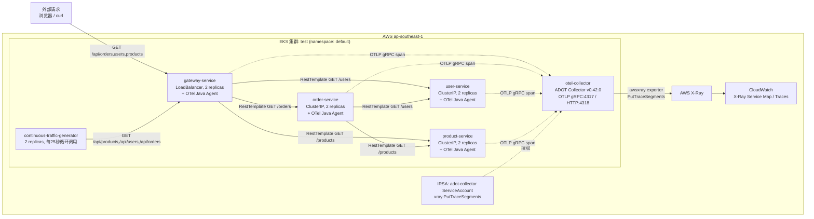

# 架构文档

## 目标

在单个 EKS 集群上部署 4 个 Spring Boot 微服务，验证通过 OpenTelemetry Java Agent 实现**零代码侵入**的分布式链路追踪，并将 trace 数据经 AWS ADOT Collector 汇聚后导出到 AWS X-Ray，在 CloudWatch 中还原完整的服务调用链路。

## 拓扑

- `gateway-service`
  - 角色：API 网关，唯一对外暴露的入口（Service type：`LoadBalancer`）
  - 副本数：2
  - 下游调用：`order-service`（`/orders`）、`user-service`（`/users`）、`product-service`（`/products`）
- `order-service`
  - 角色：订单服务，唯一同时调用两个下游服务的节点
  - 副本数：2
  - 下游调用：`user-service`（`/users`）、`product-service`（`/products`）
- `user-service`
  - 角色：用户服务，叶子节点，无下游调用
  - 副本数：2
- `product-service`
  - 角色：产品服务，叶子节点，无下游调用
  - 副本数：2
- `otel-collector`
  - AWS Distro for OpenTelemetry（ADOT）Collector `v0.42.0`
  - 角色：接收 4 个业务服务通过 OTLP 上报的 trace，批处理后导出到 AWS X-Ray
  - 监听端口：`4317`（OTLP gRPC）、`4318`（OTLP HTTP）
  - 通过 IRSA 绑定的 `adot-collector` ServiceAccount 获得 `xray:PutTraceSegments` / `xray:PutTelemetryRecords` 权限
- `continuous-traffic-generator`
  - 角色：持续产生业务流量，驱动链路数据自动生成，无需手动触发
  - 副本数：2，每 25 秒循环一轮：`/api/products` → `/api/users` → `/api/orders` → `/api/orders`

全部工作负载运行在同一个 EKS 集群（示例中命名为 `test`，区域 `ap-southeast-1`）的 `default` namespace 中，服务间通过 Kubernetes ClusterIP Service 以短域名（如 `http://order-service:8080`）互相调用。

## 架构图



## 流量路径

`continuous-traffic-generator`（或外部客户端）统一从 `gateway-service` 的 LoadBalancer 入口发起请求，调用链路根据访问的路径不同而不同：

- `GET /api/products`：`gateway-service` → `product-service`，单跳
- `GET /api/users`：`gateway-service` → `user-service`，单跳
- `GET /api/orders`：`gateway-service` → `order-service` → `user-service` + `product-service`，触发完整的四服务调用链，是本项目中最能体现分布式追踪价值的路径

每一跳请求都会经过被 `-javaagent` 注入的 OpenTelemetry Java Agent 自动埋点（拦截 `RestTemplate` 出站调用与 Spring MVC 入站请求），生成 span 并通过 trace context header 向下游传播，最终所有服务各自把 span 通过 OTLP/gRPC 异步发送到集群内的 `otel-collector`，再由 Collector 统一导出到 AWS X-Ray。

## OTel Java Agent 零代码侵入

4 个服务均未在业务代码中引入任何 OpenTelemetry SDK 依赖，而是在 `Dockerfile` 构建阶段下载 `opentelemetry-javaagent.jar`（`v2.24.0`）并做 SHA-256 校验后打入镜像，再通过容器 `ENTRYPOINT` 的 `-javaagent` 参数激活：

```dockerfile
ENTRYPOINT ["java", "-javaagent:/otel/opentelemetry-javaagent.jar", "-jar", "app.jar"]
```

这样镜像自包含、Pod 启动时无需访问外部网络下载 agent，`docker run` 本地运行同样自动生效。

## Trace Context 传播与 X-Ray 集成

`Infra/applications.yaml` 为每个服务注入以下环境变量：

| 变量 | 值 | 作用 |
|------|----|----|
| `OTEL_SERVICE_NAME` | 各服务名 | X-Ray Service Map 中的节点名称 |
| `OTEL_EXPORTER_OTLP_ENDPOINT` | `http://otel-collector:4317` | 指向集群内 ADOT Collector 的 OTLP gRPC 端口 |
| `OTEL_PROPAGATORS` | `xray,tracecontext,baggage` | 同时支持 X-Ray 格式和 W3C `tracecontext`/`baggage`，兼容 ALB 注入的 `X-Amzn-Trace-Id`，保证入口链路不断链 |
| `OTEL_METRICS_EXPORTER` / `OTEL_LOGS_EXPORTER` | `none` | 本 demo 只关注 trace，关闭指标与日志导出 |

`otel-collector` 的 pipeline 配置（`Infra/otel-collector.yaml`）为 `otlp` receiver → `memory_limiter`/`batch` processor → `awsxray` + `logging` exporter，其中 `awsxray` exporter 依赖挂载在 `adot-collector` ServiceAccount 上的 IRSA IAM 角色（权限：`xray:PutTraceSegments`、`xray:PutTelemetryRecords`）完成向 X-Ray 的写入。
